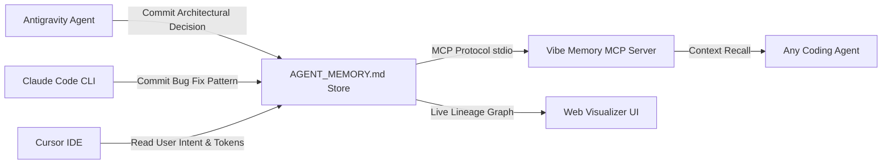

<div align="center">

# 🧠 Vibe Memory
### Universal Long-Term Memory & Cross-Agent Handoff Protocol for AI Coding Agents

[](https://github.com/shahrukh-hack)
[](LICENSE)
[](https://modelcontextprotocol.io/)
[](https://shahrukh-hack.github.io/vibe-memory/)

<br />

> **Quit Claude Code mid-task, switch to Antigravity or Cursor in the same directory, and resume without re-explaining the architecture, bug discoveries, or user preferences.**

</div>

---

## ⚡ Overview

When building complex software with AI coding agents (Antigravity, Cursor, Claude Code, OpenAI Codex, Aider), context is often lost when:
1. You hit the token limit and reset the conversation.
2. You switch from one AI agent CLI to another.
3. Multiple background subagents need to share architectural decisions.

**Vibe Memory** introduces a lightweight, vendor-neutral memory protocol powered by **`AGENT_MEMORY.md`**, standard **Model Context Protocol (MCP)** tools, and an interactive **Memory Graph Visualizer**.

---

## 🌐 Live Interactive Visualizer

Experience the visual memory lineage graph, search decisions, and generate live handoff snapshots:  
👉 **[https://shahrukh-hack.github.io/vibe-memory/](https://shahrukh-hack.github.io/vibe-memory/)**

---

## 🏗️ Architecture & Cross-Tool Flow



---

## 🚀 Quickstart & Installation

### 1. Initialize in Any Codebase
Run in your project root:
```bash
npx vibe-memory init
```
This creates the standardized `AGENT_MEMORY.md` schema with sections for:
* 📐 **Architectural Decisions (ADR)**
* 🐛 **Bug Discoveries & Edge-Case Learnings**
* 👤 **User Intent & Anti-AI-Slop Preferences**
* 🔄 **Active Handoff Checkpoints**

---

### 2. Connect via Model Context Protocol (MCP)

Add `vibe-memory` to your agent configuration:

#### **Antigravity (`~/.gemini/antigravity/mcp-config.json`)**
```json
{
  "mcpServers": {
    "vibe-memory": {
      "command": "npx",
      "args": ["-y", "vibe-memory", "mcp"]
    }
  }
}
```

#### **Cursor (`.cursor/mcp.json`)**
```json
{
  "mcpServers": {
    "vibe-memory": {
      "command": "npx",
      "args": ["-y", "vibe-memory", "mcp"]
    }
  }
}
```

#### **Claude Code (`~/.claude.json`)**
```json
{
  "mcpServers": {
    "vibe-memory": {
      "command": "npx",
      "args": ["-y", "vibe-memory", "mcp"]
    }
  }
}
```

---

## 🔄 Cross-Agent Handoff Protocol

When switching tools mid-task, generate a handoff snapshot:
```markdown
<!-- AGENT_HANDOFF_SNAPSHOT: CLAUDE_CODE ➔ ANTIGRAVITY -->
# 🔄 Context Handoff (2026-08-16T21:00:00Z)
## 🎯 Active Objective: Build MCP Stdio Server
## ✅ Accomplished: Setup schema and JSON-RPC types
## 🚀 Next Action: Implement recall_memory tool handler
<!-- END_AGENT_HANDOFF -->
```

---

## 🛠️ Local Development & Web Visualizer

```bash
git clone https://github.com/shahrukh-hack/vibe-memory.git
cd vibe-memory
npm install
npm run dev
```

---

## 👤 Author

Created with intention by **[Yogeshkumar Patel](https://github.com/shahrukh-hack)** • Adelaide, Australia 🇦🇺  
* [LinkedIn: linkedin.com/in/yogeshkumar-ai](https://www.linkedin.com/in/yogeshkumar-ai/)  
* [GitHub: @shahrukh-hack](https://github.com/shahrukh-hack)

---

## 📄 License

MIT License © 2026 Yogeshkumar Patel
