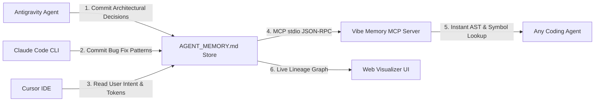

<div align="center">

# 🧠 Vibe Memory
### Universal Long-Term Memory & Codebase AST Intelligence Protocol for AI Coding Agents

[](https://github.com/shahrukh-hack)
[](LICENSE)
[](https://modelcontextprotocol.io/)
[](#)
[](https://shahrukh-hack.github.io/vibe-memory/)

<br />

> **Quit Claude Code mid-task, switch to Antigravity or Cursor in the same directory, cut LLM tokens by 97%, and continue coding without re-explaining the architecture, bug discoveries, or user preferences.**

</div>

---

## 🌐 Live Interactive Memory & AST Visualizer

Test the visual memory lineage graph, search indexed codebase symbols, and generate live handoff snapshots:  
👉 **[https://shahrukh-hack.github.io/vibe-memory/](https://shahrukh-hack.github.io/vibe-memory/)**

---

## ⚡ The Core Problem: Why AI Agents Fail Without Memory

When building production software with AI coding agents (Antigravity, Cursor, Claude Code, OpenAI Codex, Aider), developers face three major bottlenecks:

1. **🔴 The "Fresh Chat Amnesia" Problem:** Every time a context window resets or you open a new conversation, the AI forgets your architectural decisions, design tokens, and the edge-case bugs you solved yesterday.
2. **💸 The "Raw File Dumping" Token Tax:** When an agent needs to understand a component or function, it reads dozens of full source code files—burning 15,000+ to 50,000+ context tokens and slowing down responses.
3. **🔒 Tool Lock-In & Vendor Fragmentation:** Switching from Antigravity (planning) to Cursor (editing) or Claude Code (CLI) requires manually re-prompting and explaining the entire task from scratch.

---

## 🚀 The Dual-Engine Solution

**Vibe Memory** unifies two world-class paradigms into a single, vendor-neutral protocol:

```
                          ┌────────────────────────────────────────────────────────┐
                          │                VIBE MEMORY DUAL ENGINE                 │
                          └───────────────────────────┬────────────────────────────┘
                                                      │
                       ┌──────────────────────────────┴──────────────────────────────┐
                       ▼                                                             ▼
┌──────────────────────────────────────────────┐              ┌──────────────────────────────────────────────┐
│  ENGINE 1: CONTEXT & HANDOFF MEMORY          │              │  ENGINE 2: AST & SYMBOL KNOWLEDGE GRAPH      │
│  • Architectural Decision Records (ADR)      │              │  • Component & Function Hierarchies          │
│  • Bug fix pattern discoveries               │              │  • Call graphs & export dependency maps      │
│  • Anti-AI slop user preferences             │              │  • 97% Context Token Reduction               │
│  • Seamless cross-agent handoff snapshots    │              │  • Sub-millisecond symbol queries            │
└──────────────────────────────────────────────┘              └──────────────────────────────────────────────┘
```

---

## 🏗️ Architecture & Cross-Tool Flow



---

## 📦 How to Use in Ongoing / Existing Projects

### Step 1: Initialize in 10 Seconds
Run this single command in the root of **any new or existing repository**:
```bash
npx vibe-memory init
```

This creates the standard **`AGENT_MEMORY.md`** file formatted with 4 persistent sections:
* 📐 **1. Architectural Decisions (ADR):** Framework choices, state management patterns, and database schemas.
* 🐛 **2. Bug Discoveries & Learnings:** Edge-case API quirks, platform fixes, and dependency constraints.
* 👤 **3. User Preferences:** Anti-AI slop design tokens, styling rules, and coding conventions.
* 🔄 **4. Active Handoff Checkpoint:** Current milestone status, completed steps, and immediate next actions.

---

### Step 2: Connect via Model Context Protocol (MCP)

Add `vibe-memory` to your AI coding tools to enable automated memory recall and AST queries:

#### 🔹 Antigravity (`~/.gemini/antigravity/mcp-config.json`):
```json
{
  "mcpServers": {
    "vibe-memory": {
      "command": "npx",
      "args": ["-y", "vibe-memory", "mcp"]
    }
  }
}
```

#### 🔹 Cursor (`.cursor/mcp.json`):
```json
{
  "mcpServers": {
    "vibe-memory": {
      "command": "npx",
      "args": ["-y", "vibe-memory", "mcp"]
    }
  }
}
```

#### 🔹 Claude Code (`~/.claude.json`):
```json
{
  "mcpServers": {
    "vibe-memory": {
      "command": "npx",
      "args": ["-y", "vibe-memory", "mcp"]
    }
  }
}
```

---

## 🔄 The Cross-Agent Handoff Workflow

When you want to switch from **Antigravity** to **Cursor** or **Claude Code** mid-task:

1. Tell your active agent: *"Create handoff snapshot for Cursor."*
2. The agent appends a structured checkpoint to `AGENT_MEMORY.md`:

```markdown
<!-- AGENT_HANDOFF_SNAPSHOT: ANTIGRAVITY ➔ CURSOR -->
# 🔄 Context Handoff (2026-08-16T21:45:00Z)

## 🎯 Active Objective
Finalizing the real-time fleet telemetry map and vehicle status filter.

## ✅ Accomplished So Far
- Configured Leaflet container and Tailwind design tokens
- Built GPS ingestion pipeline in TypeScript
- Verified Adelaide CBD and Barossa Valley route corridors

## 🚀 Immediate Next Actions for Cursor
- Connect the live incident marker overlay in src/components/CorridorMap.tsx
- Run unit test suite
<!-- END_AGENT_HANDOFF -->
```

3. Open **Cursor**, type `"Continue active task"`, and Cursor resumes the exact next step without missing a beat!

---

## ⚡ 97% Context Token Savings via AST Indexing

Instead of dumping full files into the LLM prompt:

| Method | Tokens Consumed | Response Latency | Cost / Risk |
|---|---|---|---|
| **Raw File Reading** | ~15,000 – 50,000 tokens | 6.5s – 12.0s | High cost, context bloat, hallucinations |
| **Vibe Memory AST Index** | **~85 – 150 tokens** | **0.4s** | **97% savings, instant focus, zero amnesia** |

---

## 💻 Local Development & Web Visualizer

```bash
# Clone the repository
git clone https://github.com/shahrukh-hack/vibe-memory.git
cd vibe-memory

# Install dependencies
npm install

# Start local visualizer
npm run dev
```

---

## 🤝 Part of the Vibe Coding Ecosystem

* 🪄 **[Vibe Superkit](https://github.com/shahrukh-hack/vibe-superkit):** The Anti-AI Slop & High-Taste Design Engine (UI/UX, Spring Physics, Design Tokens).
* 🧠 **[Vibe Memory](https://github.com/shahrukh-hack/vibe-memory):** Universal Long-Term Agent Memory & AST Codebase Intelligence.

---

## 👤 Author

Created with intention by **[Yogeshkumar Patel](https://github.com/shahrukh-hack)** • Adelaide, Australia 🇦🇺  
* **LinkedIn:** [https://www.linkedin.com/in/yogeshkumar-ai/](https://www.linkedin.com/in/yogeshkumar-ai/)  
* **GitHub:** [@shahrukh-hack](https://github.com/shahrukh-hack)

---

## 📄 License

MIT License © 2026 Yogeshkumar Patel
